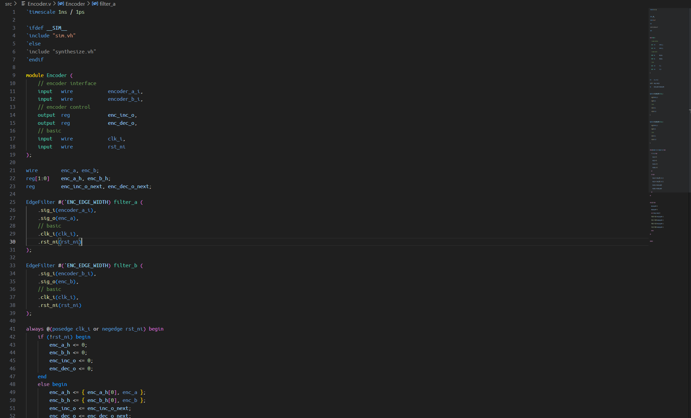
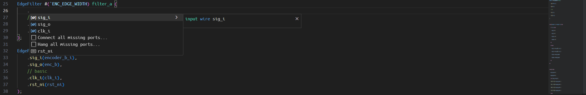
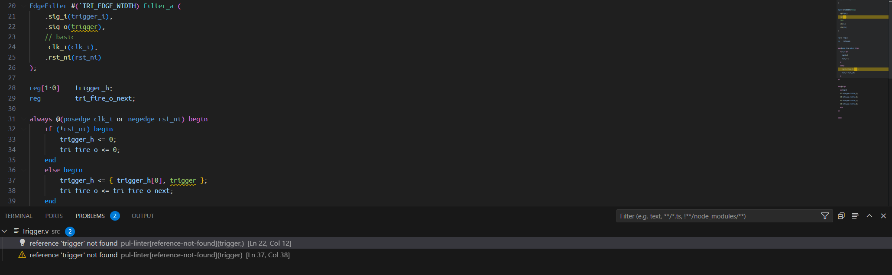
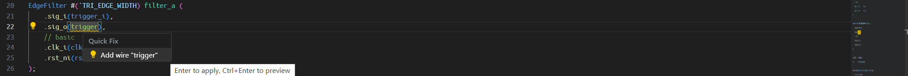
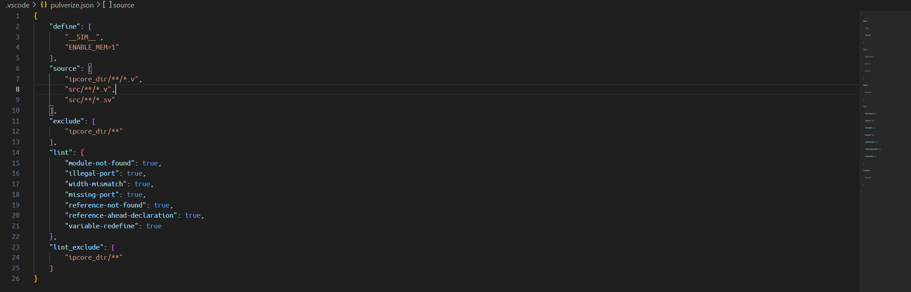

# Pulverize Verilog Support
This is a Verilog extension for VS Code

## Features
* 
* Parse verilog and system-verilog by antlr4
* Semantic color theme for verilog and system-verilog
* Display symbol defination on mouse hover
* Go symbol defination on mouse click
* Show document symbols in editor on command '@'
* 
* Code completion of symbols, macros or module ports
* 
* Detect parse errors and lint warnings
* 
* Quick fix for missing symbol
* Find references of symbols

## Configuration
* 
* create .vscode/pulverize.json in a workspace
* *define* macros to be pre-defined in all source
* *source* glob patterns indicate source files to be parsed
* *exclude* glob patterns indicate source files to be excluded
* *lint* flags indicate the lint items activated in parse
* *lint_exclude* glob patterns indicated source files to be excluded in lint

## Parse
* parse exception will be treated as error

## Lint
* lint exception will be treated as warning
* set fields of *lint* in **Configuration** to false will ignore the exception
* *module-not-found* module declaration not found in all parsed sources
* *illegal-port* connect port of module instance is not found in module declaration
* *width-mismath* width of RHS expression is less than LHS symbol
* *reference-not-found* reference of a invaild symbol
* *reference-ahead-declaration* reference of a symbol declared behind the reference
* *variable-redefine* define a symbol more than once

**Enjoy!**
